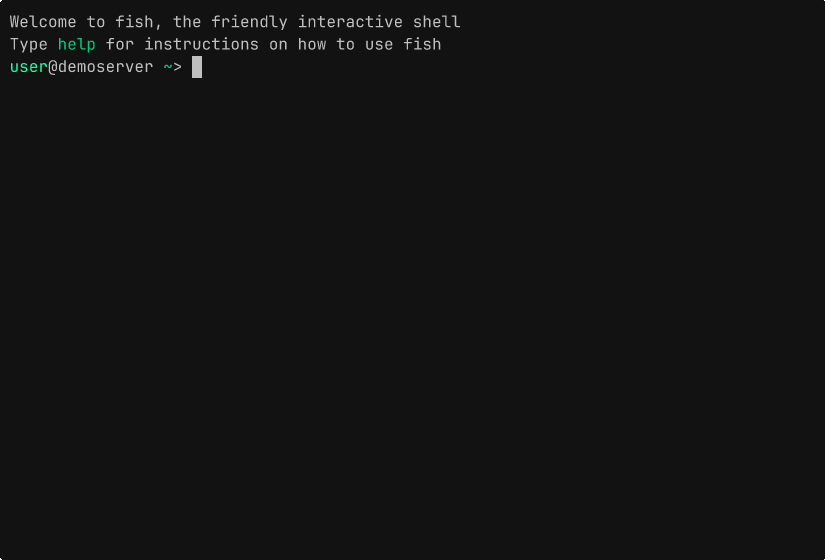

# quickpath.fish

Automatically substitute path abbreviations in fish interactive shell.
Implemented using pure fish.

[](https://asciinema.org/a/h0n5SxKKk84jwF0F)


## When to use quickpath

[Fish shell ships with `abbr`][fish:abbr],
a built-in feature that replaces specific "words" with **longer phrases** when entered.
An excerpt in the official documentation:

> For example, a frequently-run command like `git checkout`
> can be abbreviated to `gco`.
> After entering `gco` and pressing <kbd>space</kbd> or <kbd>enter</kbd>,
> the full text `git checkout` will appear in the command line.
> To avoid expanding something that looks like an abbreviation,
> the default <kbd>ctrl</kbd> + <kbd>space</kbd> binding
> inserts a space without expanding.

quickpath complements `abbr` by providing quick, ergonomic
path completion with a streamlined configuration mechanism.
Instead of waiting for <kbd>space</kbd> or <kbd>enter</kbd>,
quickpath uses the <kbd>/</kbd> key to instantly trigger the expansion
of pre-defined shortcuts into full path strings,
thus allowing you to seamlessly keep typing the rest of the path.

**Example:** If you configure `c` to map to `~/.config/`,
then typing `cd c/fish/conf.d` will instantly expand the `c/` portion
into `~/.config/` the exact moment you press the first <kbd>/</kbd> key.


## Installation

Install with [fisher](https://github.com/jorgebucaran/fisher):

```fish
fisher install abhabongse/quickpath.fish  # assumes github.com by fisher command
```

Alternatively, you may copy respective files into `$FISH_CONFIG_DIR` directory
such as `~/.config/fish/` in the default cases.


## Usage Examples

```fish
# Set a quickpath substitution mapping for c/ into ~/.config/
quickpath --set c \~/.config/

# When a user types in the following (without needing to hit tab or return) ...
cd c/
# ... it immediately substitutes the prompt into the following
cd ~/.config/

# Add more quickpath mapping
# - Quickpath key may contain multiple characters
# - Subsituted path may contain spaces (do not forget to escape)
# - Path with spaces with be quoted when substituted
quickpath --set mv \~/Music/Music\ Videos/

# List all configured mappings
quickpath --list

# Remove some mappings
quickpath --unset df
```

Full usage text:

```
Usage: quickpath [OPTIONS]

Options:
  -l, --list              List all quickpath mappings
  --set <key> <path>      Create or update a quickpath mapping
  --unset <key>           Remove a quickpath mapping

Examples:
  quickpath --set c \~/.config/
  quickpath --set d \~/Documents/
  quickpath --list
  quickpath --unset c
```


## Configuration

Command `quickpath --set` affects only the running interactive session
and does not persist across multiple sessions.
To set up quickpaths permanently, copy [`quickpath.conf.fish`](./quickpath.conf.fish)
from this repo to `$FISH_CONFIG_DIR/conf.d/quickpath.conf.fish`
(any filename ending in `.fish` inside that directory will work)
and edit it to taste.

Files under `$FISH_CONFIG_DIR/conf.d/` are autoloaded by fish at startup.
You may also place the commands directly in `$FISH_CONFIG_DIR/config.fish`.

Do not edit `conf.d/quickpath.fish` inside the plugin's own directory:
fisher overwrites that file on update, which would erase your configuration.


## Help, Support, and Contribute

The project is maintained at [Codeberg][codeberg:repo]
and routinely mirror-pushed to [GitHub][github:repo].

If you are a user of this package, or if you have feedback or suggestions,
I would like to hear from you!

- [Create an issue on Codeberg][codeberg:issue]
- [Create a discussion on GitHub][github:discussion]
- Or send me a direct message


## Transparency Disclaimer

I used Large Language Models (LLMs) to help build this plugin,
specifically to audit my design choices and scaffold fish completion scripts.
I have done my due-diligence to validate, test, and cross-reference every line
of code against the official fish documentation before publishing it here.


## License

[Apache-2.0](./LICENSE) © Abhabongse Janthong


[codeberg:repo]: https://codeberg.org/abhabongse/quickpath.fish

[codeberg:issue]: https://codeberg.org/abhabongse/quickpath.fish/issues

[github:repo]: https://github.com/abhabongse/quickpath.fish

[github:discussion]: https://github.com/abhabongse/quickpath.fish/discussions

[fish:abbr]: https://fishshell.com/docs/current/cmds/abbr.html
